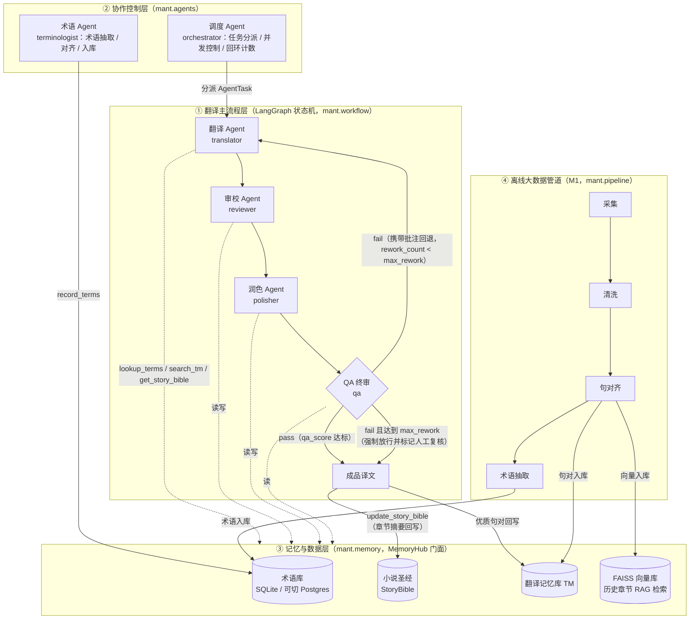
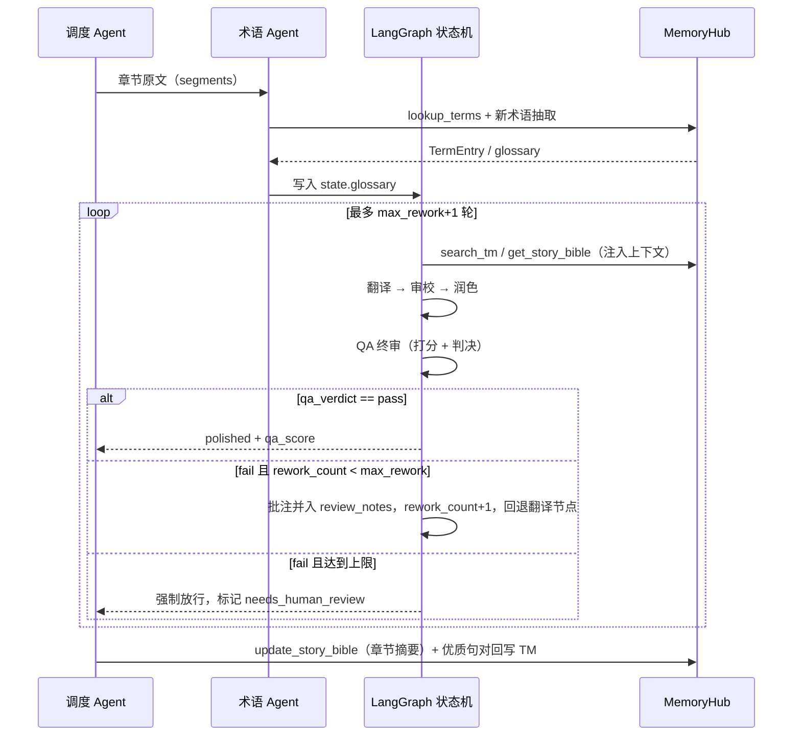
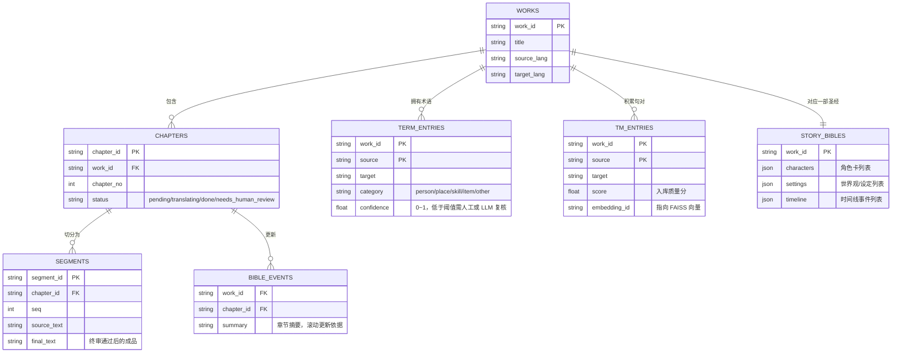

# 总体架构设计

> 项目：基于大数据与多智能体协作的网络小说自主翻译系统（MultiAgent-Novel-Translation, 包名 `mant`）
> 读者对象：课程设计 / 毕业论文评审。本文档描述系统总体架构、四层划分、核心数据流与接口约定。

---

## 1. 设计目标

面向网络小说（长篇、连载、强人设、强术语体系）的汉译外场景，构建一个"多智能体协作 + 大数据语料驱动"的自动翻译系统。相对单 LLM 直译基线，系统需要解决四个核心问题：

1. **术语一致性**：人名、地名、功法、法宝等专有名词在全书中保持一致（术语库 + 术语 Agent）。
2. **长程上下文连贯**：角色设定、世界观、时间线跨章节不漂移（小说圣经 + 向量检索 RAG）。
3. **译文质量可控**：译文经过审校、润色、QA 终审多环节把关，不达标可携带批注自动回退返工（LangGraph 状态机回环）。
4. **效果可度量**：有离线语料管道供给术语/TM 数据，有系统化的实验评测方案（基线对比 + 消融实验）。

## 2. 四层架构总览

系统自上而下划分为四层：翻译主流程层、协作控制层、记忆与数据层、离线大数据管道。



四层职责一句话概括：

| 层 | 模块路径 | 职责 |
| --- | --- | --- |
| ① 翻译主流程层 | `mant.workflow` | 用 LangGraph 状态机串联"翻译→审校→润色→QA 终审"，并实现 QA 不达标携带批注回退返工的回环 |
| ② 协作控制层 | `mant.agents` | 调度 Agent 负责任务分派与回环控制；术语 Agent 负责术语全生命周期管理 |
| ③ 记忆与数据层 | `mant.memory` | MemoryHub 统一门面，屏蔽术语库（SQLite/可切 Postgres）、小说圣经、TM、FAISS 向量库的存储细节 |
| ④ 离线大数据管道 | `mant.pipeline` | M1 阶段产物：采集→清洗→句对齐→术语抽取，为线上翻译供给术语库、TM 与向量数据 |

## 3. 翻译主流程与 QA 返工回环

### 3.1 状态定义（团队约定，勿改）

主流程在 LangGraph 上运行，节点间共享状态 `mant.workflow.state.TranslationState(TypedDict)`：

| 字段 | 类型 | 写入节点 | 含义 |
| --- | --- | --- | --- |
| `work_id` | `str` | 入口 | 作品 ID（关联记忆层一切数据） |
| `chapter_id` | `str` | 入口 | 章节 ID |
| `segments` | `list[str]` | 入口 | 待译原文段列表（按段推进） |
| `glossary` | `dict` | 术语 Agent | 本章命中的术语映射 `{源术语: 译名}` |
| `draft` | `str` | 翻译 / 审校 | 当前译稿（审校节点原地修订） |
| `review_notes` | `list` | 审校 / QA | 批注列表；QA 判 fail 时追加结构化批注，作为回退返工的输入 |
| `polished` | `str` | 润色 | 润色后的译稿 |
| `qa_score` | `float` | QA 终审 | 质量分（0–100） |
| `qa_verdict` | `str` | QA 终审 | `"pass"` / `"fail"` |
| `rework_count` | `int` | 调度（条件边） | 当前回退返工次数 |
| `max_rework` | `int` | 入口（取自 `workflow.max_rework`） | 回退次数上限，防止死循环 |

### 3.2 主流程时序



### 3.3 回环设计要点

- **批注驱动返工**：QA 判 fail 时必须给出结构化批注（错误位置、类型、修改建议），追加到 `review_notes`；翻译节点在下一轮把批注作为硬约束注入 Prompt，而不是盲目重译。
- **上限兜底**：`rework_count >= max_rework` 时强制放行并打 `needs_human_review` 标记，避免 LLM 间互相不认可导致的死循环与费用失控。上限默认值取配置 `workflow.max_rework`。
- **回退落点**：当前设计回退到"翻译"节点（携带审校与 QA 的全部批注重译）；如实验表明重译不如定点修订，可在 M4 联调期改为回退到"审校"节点，状态机条件边留有此扩展点。

## 4. 协作控制层

- **调度 Agent（orchestrator）**：不直接翻译，负责把"一部作品 × 一章"拆成 `AgentTask` 序列、控制段级并发、调用状态机、维护 `rework_count`、失败重试与降级（如某 Agent 异常时跳过润色直送 QA 并记录）。尽量用规则实现，仅在需要计划/排序时调用 fast 档模型。
- **术语 Agent（terminologist）**：章节翻译前扫描原文，命中已有术语库（`lookup_terms`），并对疑似新术语做抽取与翻译，写入 `state.glossary` 与术语库（`record_terms`）。保证"同一作品内，先入库者为准"。

各 Agent 的详细职责、输入输出契约与 Prompt 设计见 [agent-design.md](./agent-design.md)。

## 5. 记忆与数据层

### 5.1 MemoryHub 统一门面（团队约定，勿改）

所有 Agent 只面向 `mant.memory.MemoryHub` 编程，不直接触碰 SQL 或 FAISS：

| 方法签名 | 用途 |
| --- | --- |
| `lookup_terms(terms: list[str], work_id: str) -> dict[str, TermEntry]` | 批量查询术语译名 |
| `search_tm(source_text: str, work_id: str, k: int = 5) -> list[TMMatch]` | 检索相似历史句对（翻译记忆） |
| `get_story_bible(work_id: str) -> StoryBible` | 读取小说圣经（角色/设定/时间线） |
| `record_terms(entries: list[TermEntry]) -> None` | 术语入库 |
| `update_story_bible(work_id: str, chapter_id: str, summary: str) -> None` | 章节译完后回写摘要，滚动更新圣经 |

数据模型（`mant.memory.models`，一律 `dataclass`，不用 pydantic）：

| 模型 | 字段 |
| --- | --- |
| `TermEntry` | `source, target, category, work_id, confidence` |
| `TMMatch` | `source, target, score` |
| `StoryBible` | `work_id, characters: list, settings: list, timeline: list` |

### 5.2 存储 ER 草图



设计说明：

- **术语库**默认 SQLite（`memory.sqlite_path`），通过连接串参数可切换 Postgres，SQL 层用参数化查询，方言差异收敛在存储适配器内部。
- **TM 与 FAISS**：句对文本存 SQLite，向量存 FAISS（`memory.faiss_index_dir`），以 `embedding_id` 关联；`search_tm` 内部完成"向量召回 + 分数重排"。FAISS 为可选依赖，缺失时降级为 SQLite 全文/子串检索并在日志中给出安装提示。
- **小说圣经**以 JSON 文档形式存储（SQLite JSON 列或独立 JSON 文件均可），三个列表字段的结构约定见数据管道文档。

## 6. 离线大数据管道（M1）

管道四步：**采集 → 清洗 → 句对齐 → 术语抽取**，全部离线批处理，产出物直接初始化记忆层：

- 句对齐产物（JSONL 句对）→ TM 表 + FAISS 向量；
- 术语抽取产物（JSONL 术语表）→ 术语表 + 术语库；
- 目录由配置驱动：`pipeline.raw_dir`（原始语料）、`pipeline.aligned_dir`（句对）、`pipeline.glossary_dir`（术语表）。

详细 schema、质量指标与合规要求见 [data-pipeline.md](./data-pipeline.md)。

## 7. 配置项一览（config/settings.example.yaml）

| 配置键 | 消费方 | 说明 |
| --- | --- | --- |
| `llm.providers.*` | `LLMClient.from_config` | 分 `fast` / `strong` 两档模型（型号、密钥、单价等） |
| `memory.sqlite_path` | MemoryHub | SQLite 文件路径；换 Postgres 时替换为连接串 |
| `memory.faiss_index_dir` | MemoryHub | FAISS 索引目录 |
| `pipeline.raw_dir` / `pipeline.aligned_dir` / `pipeline.glossary_dir` | 管道四步 | 语料与产物目录 |
| `workflow.max_rework` | 状态机入口 | QA 回退次数上限 |

约定：除 CLI/脚本入口外，所有模块通过构造参数接收配置字典，不直接读取配置文件。

## 8. 源码布局（src 布局，包名 `mant`）

```text
src/mant/
├── llm/            # LLMClient：fast/strong 双档，缺 key 返回 [DRAFT] 占位
├── agents/         # base.py（AgentTask/AgentResult/BaseAgent）+ 六个 Agent
├── workflow/       # state.py（TranslationState）+ LangGraph 图构建与条件边
├── memory/         # models.py（dataclass）+ MemoryHub 门面 + SQLite/FAISS 适配
├── pipeline/       # M1 四步：collect / clean / align / extract_terms
├── eval/           # M5 评测：COMET、LLM-as-Judge、MQM 汇总脚本
└── cli.py          # 命令行入口（唯一允许直接读配置文件的模块）
```

## 9. 关键工程约定（横切关注）

1. **骨架级别**：定义类、函数签名、数据模型、Prompt 模板与 TODO 标记，不写完整业务实现。
2. **延迟导入**：`langgraph` / `openai` / `faiss` / `pyyaml` 等第三方库一律函数内 import 或 try/except 降级并给出安装提示，保证仅 stdlib+numpy 环境下 `import mant.*` 全部成功、`python -m unittest` 可运行。
3. **数据模型**：一律 `dataclass`；中文 docstring + 中文注释 + 类型注解。
4. **Agent 统一接口**：`BaseAgent(llm, memory=None)`，抽象方法 `run(task: AgentTask) -> AgentResult`；`AgentTask` 字段为 `work_id, chapter_id, segment_id, source_text, context`；`AgentResult` 字段为 `agent, ok, output, notes`。各 Agent 的 `output` 键约定见 agent-design.md 第 2 节。
5. **LLM 占位行为**：未配置 API key 时 `LLMClient.complete` 返回 `[DRAFT]` 前缀占位响应，保证全链路在无网无 key 环境可跑通演示与单测。
