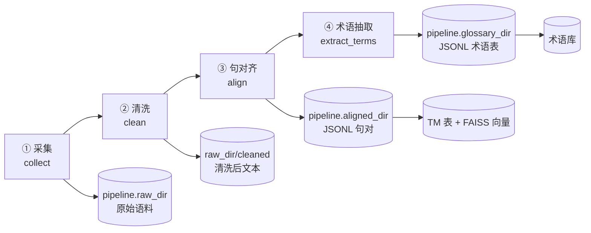

# 离线大数据管道（M1）设计

> 本文档定义 M1 阶段语料管道的四个步骤（采集 → 清洗 → 句对齐 → 术语抽取）、句对与术语表的 JSONL schema，以及语料合规要求。
> 管道为纯离线批处理，产出物用于初始化记忆与数据层（术语库 / TM / FAISS 向量库），不在在线翻译链路上。

---

## 1. 管道总览



目录均由配置键驱动：`pipeline.raw_dir`、`pipeline.aligned_dir`、`pipeline.glossary_dir`；管道模块以参数接收配置字典，不直接读配置文件（CLI 入口除外）。

## 2. 四步详设

### 2.1 采集（collect）

- **目标**：获取合法可用的汉外双语小说语料与单语原文语料。
- **来源优先级**：
  1. 公版 / 开放授权双语作品（如 Project Gutenberg 及其公版中译）；
  2. 明确授权用于科研的平行语料库；
  3. 已购或已获授权的网络小说样章（仅内部研究使用，见第 5 节合规）。
- **做法**：HTTP 抓取遵守 robots.txt 与站点条款，限速（默认 ≥2s/请求），保留来源 URL、抓取时间、授权信息到元数据文件 `raw_dir/_meta.jsonl`。
- **产物**：原始 HTML/TXT，按 `raw_dir/<work_id>/chapter_*.txt` 存放。
- **质量指标**：抓取成功率、重复率、元数据完整率。
- **本地 TXT 编码**：`LocalTxtCollector` 读取原始字节，自动识别 BOM、
  GBK/GB18030、Big5、UTF-16/32 与常见日韩/西文编码，内部统一为
  Unicode/UTF-8，并在 `RawDocument.meta.source_encoding` 保留原编码。

### 2.2 清洗（clean）

- **目标**：把原始文本变成干净、规整、可切句的章节文本。
- **规则清单**（按序执行）：
  1. 去 HTML 标签、脚本、广告与导航样板文本；
  2. 对采集阶段已解码的 Unicode 文本做全半角与引号规范，去乱码与控制字符；
  3. 章节边界校正（按"第X章"等模式），丢弃过短章节（如 < 500 字）；
  4. 语种识别与过滤（非源语种段落打标剔除）；
  5. 章节级去重（simhash 近似去重，阈值可调）；
  6. 段落切分规范化（保留自然段，合并断行）。
- **产物**：`raw_dir/cleaned/<work_id>/chapter_*.txt` + 清洗报告（每章丢弃行数与原因计数）。
- **质量指标**：清洗保留率、人工抽检合格率（每部作品随机 2 章）。

### 2.3 句对齐（align）

- **目标**：把同一章的双语版本切句并对齐为 1:1（含 1:多合并）句对。
- **流程**：章节配对（按章节号/标题映射）→ 分句（中文按句末标点，英文按 nltk/正则句边界规则）→ 嵌入向量相似度对齐。
- **方法**：
  - 首选 **vecalign**（或 LASER 句向量）做动态规划对齐；
  - 降级方案（vecalign/laser 未安装时）：Gale-Church 长度对齐 + 标点/数字锚点启发式，并在输出中标记 `align_method="length"`；
  - 两者均属可选依赖，遵循延迟导入约定，缺失时给安装提示并自动降级。
- **过滤**：`align_score` 低于阈值（默认 0.6，可调）的句对进入 `*.review.jsonl` 人工复核队列，不进主产物。
- **产物**：`aligned_dir/<work_id>.jsonl`（schema 见第 3 节）。
- **质量指标**：对齐覆盖率（源句被对齐比例）、抽样人工准确率（目标 ≥ 95%）、句对总量。
- **入库**：合格句对写入 TM 表并计算向量写入 FAISS（`embedding_id` 关联）。

### 2.4 术语抽取（extract_terms）

- **目标**：从对齐句对中自动抽取领域术语并生成初版术语表。
- **做法**：
  1. 统计候选：源侧命名实体与高频名词短语（频次 ≥3），译侧用句对共现对齐找对应译文；
  2. LLM 复核：fast 档模型按批次确认"是否术语 + 类别 + 标准译名"，输出 `confidence`；
  3. 冲突处理：与已有术语库冲突时保留库内译名，新条目标记待人工（与在线术语 Agent 同策略）。
- **产物**：`glossary_dir/<work_id>.jsonl`（schema 见第 4 节），通过 `record_terms` 入库。
- **质量指标**：抽样精度/召回（人工标注 200 条候选为金标准）、低置信条目占比。

## 3. JSONL 句对 schema（`aligned_dir/<work_id>.jsonl`）

每行一个 JSON 对象：

| 字段 | 类型 | 必填 | 说明 |
| --- | --- | --- | --- |
| `id` | string | 是 | 全局唯一 ID：`<work_id>/<chapter_id>/<seq>` |
| `work_id` | string | 是 | 作品 ID |
| `chapter_id` | string | 是 | 章节 ID |
| `segment_id` | string | 是 | 段/句 ID，与线上 `AgentTask.segment_id` 同规则 |
| `seq` | int | 是 | 章内序号（从 0 起） |
| `source_lang` | string | 是 | 如 `"zh"` |
| `target_lang` | string | 是 | 如 `"en"` |
| `source_text` | string | 是 | 源句 |
| `target_text` | string | 是 | 对齐译句 |
| `align_score` | float | 是 | 对齐置信度 0–1 |
| `align_method` | string | 是 | `"vecalign"` / `"laser"` / `"length"` / `"manual"` |
| `license` | string | 是 | 语料授权标识（对应 `_meta.jsonl`） |
| `source_url` | string | 否 | 出处 URL（合规追溯用） |

示例：

```json
{"id": "wuxia_001/ch_003/12", "work_id": "wuxia_001", "chapter_id": "ch_003", "segment_id": "12", "seq": 12, "source_lang": "zh", "target_lang": "en", "source_text": "他深吸一口气，缓缓拔出了背后的长剑。", "target_text": "He took a deep breath and slowly drew the longsword from his back.", "align_score": 0.93, "align_method": "vecalign", "license": "CC-BY-4.0", "source_url": "https://example.org/wuxia_001/ch3"}
```

## 4. 术语表 schema（`glossary_dir/<work_id>.jsonl`）

字段与 `mant.memory.models.TermEntry` 对齐，另加管道期元数据（入库时忽略多余字段）：

| 字段 | 类型 | 必填 | 说明 |
| --- | --- | --- | --- |
| `source` | string | 是 | 源术语（对应 `TermEntry.source`） |
| `target` | string | 是 | 标准译名（对应 `TermEntry.target`） |
| `category` | string | 是 | `person / place / skill / item / faction / title / other` |
| `work_id` | string | 是 | 所属作品 |
| `confidence` | float | 是 | 0–1；< 0.7 进人工复核队列 |
| `occurrences` | int | 否 | 语料中出现次数 |
| `first_seen_chapter` | string | 否 | 首次出现章节 |
| `status` | string | 否 | `"auto"` / `"reviewed"` / `"locked"`（人工锁定后不可覆盖） |

示例：

```json
{"source": "炼气期", "target": "Qi Refining Stage", "category": "skill", "work_id": "wuxia_001", "confidence": 0.97, "occurrences": 42, "first_seen_chapter": "ch_001", "status": "reviewed"}
```

## 5. 合规要求

> 本节同时写入论文"伦理与合规"小节，任何管道改动不得违反以下条款。

1. **版权**：仅采集公版、开放许可（保留许可标识）或已获书面授权的作品；禁止绕过付费墙、登录墙或反爬机制；禁止采集明确声明禁止抓取的站点。
2. **robots 与条款**：抓取前检查 robots.txt 与站点 ToS；限速抓取；保留抓取日志备查。
3. **使用范围**：语料仅用于课程设计/毕业论文的内部研究与实验，**不重新分发原文语料**，论文与附录中只引用不超过合理引用限度的片段并注明出处。
4. **出版物比对**：若使用已出版官方译本作为评测参考译文，仅作学术评价用途，不纳入术语库/TM 的再分发产物。
5. **个人信息**：清洗步骤过滤含真实个人信息的文本（评论区的邮箱、电话等），发现即删除。
6. **存储与销毁**：语料保存在本地 `pipeline.raw_dir` 等受控目录；项目结题或授权到期后按要求删除未授权语料，并在 `_meta.jsonl` 记录销毁时间。
7. **模型调用合规**：管道调用 LLM 复核术语时，仅发送必要文本片段，不上传整部作品到第三方 API 之外的存储。
